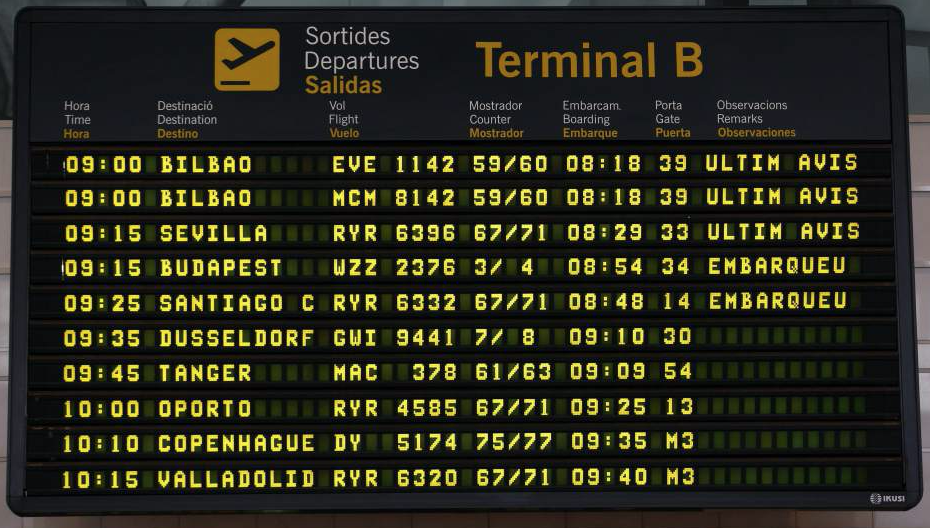
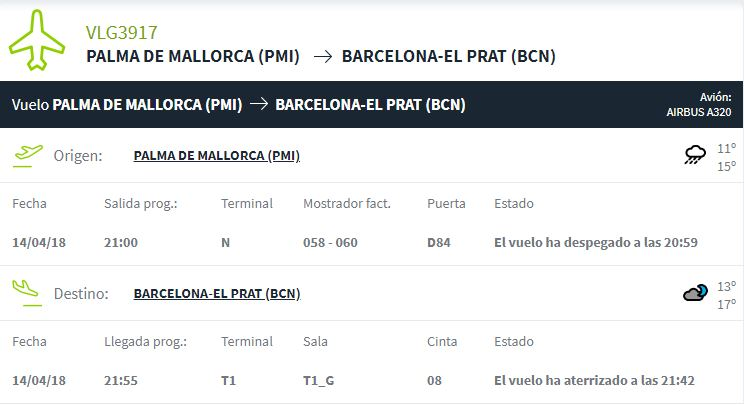
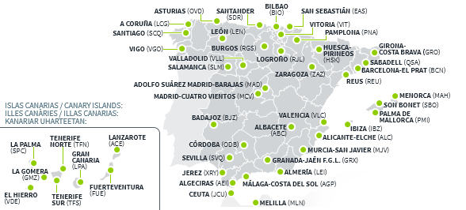

# Aena Info Vuelos
> Información sobre vuelos en los aeropuertos españoles

# Contexto y origen de los datos

Viajar es una de las actividades preferidas de las personas. Sin importar el motivo, anualmente más de 3 mil millones de personas visitan diferentes destinos (Cantidad de viajeros). En el caso de los españoles, no solo seleccionan placeres internacionales. Según el Instituto Nacional de Estadística, en el año 2017, 6.298.419 españoles visitaron lares foráneos. Sin embargo, 57.693.025 locales, ya sea por motivos de trabajo o placer, se trasladaron dentro del país y de estos, más de 2 millones mediante el tercer medio más utilizado en España para estos fines, el transporte aéreo (Libro INE).

Cada aerolínea tiene su propia web, donde los clientes pueden comprar billetes, realizar la facturación, y obtener información actualizada sobre el estado de sus vuelos.

Además, han surgido diferentes webs dedicadas a ofrecer servicios relacionados con el transporte aéreo. La mayoría se orientan a la búsqueda de vuelos y comparación de precios para encontrar la más barata, son los llamados metabuscadores, como [Kayak](https://www.kayak.com) o [Skyscanner](https://www.skyscanner.es/).  

También han surgido algunas Webs especializadas en ofrecer información en tiempo real sobre vuelos y aeropuertos, siendo [FlightStats](https://www.flightstats.com) una de las más conocidas. 

Todas estas webs son servicios de agregación, pues  obtienen y combinan en un único punto de acceso, datos procedentes de distintas fuentes, con el fin de ofrecer un valor añadido al usuario (encontrar el vuelo más barato en el primer caso, ofrecer información adicional o presentarla en un formato más atractivo o útil).

La gestión de los aeropuertos y el tráfico aéreo en España recae en la empresa **Aena SME, S.A**, una empresa a medio camino entre los público y lo privado. En este proyecto nos planteamos obtener, mediante técnicas de *scraping*, información sobre los vuelos que con origen o destino en los aeropuertos españoles, la cual se puede obtener de la Web de dicha empresa
[(https://www.aena.es)](https://www.aena.es). En particular, desde la sección denominada **Infovuelos** es posible obtener información sobre los vuelos que llegan o despegan de cualquier aeropuerto ubicado en territorio español. Los autores de este proyecto pensamos que una recopilación sistemática de esta información permitiría realizar análisis a posteriori con los cuales obtener un valor añadido, como extracción de conocimiento nuevo, visualizaciones o generación de informes, tal y como describimos con más detalle en la sección Inspiración.

Este documento ofrece información sobre los datos obtenidos mediante la utilización del software desarrollado en este proyecto. La información de naturaleza más técnica relacionada con el proyecto se puede consultar en la [Wiki](https://github.com/InnocenceAllen/AENA_Info_Vuelos/wiki/Home) asociada.

## Contenido

La información capturada contiene los detalles de todos los vuelos que discurren por los aeropuertos españoles en un momento dado. Los detalles de cada vuelo incluyen la información más elemental, como el número de vuelo, la fecha y la hora, y los aeropuertos de origen y destino. Pero además, se incluyen otros atributos a priori menos interesantes pero con potencial para realizar tareas de minería de datos a posteriori, como el modelo de avión o las previsiones climáticas para los lugares de origen y destino.

La siguiente imagen muestra una captura de pantalla de la Web Infovuelos con la información de un vuelo en particular, lo que nos da idea del tipo de datos que vamos a capturar.

### Estructura de los datos

En total, para caracterizar cada vuelo hemos encontrado un total de 24 atributos, aunque no siempre están presentes, sobre todo cuando se trata de aeropuertos internacionales.:

| Campo | Descripción | Tipo de dato | Muestra |
| ----- | ----------- | ---- | ------- |
| flightNumber | Número de vuelo | String |	AEA7232 |
| plane | Nombre del avión | String	| ATR-72 |
| dep_date | Fecha de salida | Datetime	|13/04/18
| dep_time | Hora de salida | Datetime	| 06:30
| dep_airport_name | Nombre del aeropuerto de origen | String |	A Coruña|
| dep_airport_code | Código del aeropuerto de origen | String |	LCG|
| dep_terminal | Terminal de salida | String |	1 |
| dep_status | Estado de salida | String |	Salida prevista a las 07:00|
| dep_weather_min | Temperatura mínima en origen | Integer|	10|
| dep_weather_max | Temperatura máxima en origen | Integer |	15|
| dep_weather_desc | Descripción del clima en origen | String |	Nubosidad variable|
| dep_counter | Mostrador de facturación | Integer |	6|
| dep_door | Puerta de embarque | Integer |	7|
| arr_date | Fecha de llegada | Datetime |13/04/18|
| arr_time | Hora de llegada | Datetime |	08:40|
| arr_airport_name | Nombre del aeropuerto de destino | String | Barcelona-El Prat|
| arr_terminal | Terminal de destino | String |	T1|
| arr_status | Estado de llegada |String|	Llegada prevista a las 08:40|
| arr_weather_min | Temperatura mínima en destino | Integer |	12|
| arr_weather_max | Temperatura máxima en destino | Integer |	17|
| arr_weather_desc | Descripción del clima en destino | String |	Lluvia débil|
| arr_room | Sala de recepción | String |	T1_G |
| arr_belt | Cinta de equipajes | Integer |	7 |
| timestamp | Tiempo de captura | Datetime | 2018-04-12 23:42:0 8|

### Origen de los datos

Los datos obtenidos proceden de todos los aeropuertos ubicados en territorio español gestionados por Aena, los cuales incluyen, a fecha de hoy (15/04/2018) 46 aeropuertos y 2 helipuertos. La siguiente imagen muestra la ubicación de los aeropuertos incluidos.

Con el propósito de ofrecer un ejemplo de la información que se obtiene ejecutando el proyecto, se incluye un fichero en formato *csv* con los datos obtenidos durante 48 horas consecutivas, a intervalos de una hora. Es decir, el proceso de scraping se repitió a intervalos regulares de una hora. El período de tiempo comprende desde el día 13/4/2018 a las 10:30 hasta el 15/4/2018 a las 19:00, y comprende cerca de 40000 registros.

## Inspiración

El viajero puede utilizar la Web de AENA para obtener información en tiempo real sobre su vuelo: terminal de salida o llegada, mostrador donde obtener tarjeta de embarque y facturar equipaje, sala de llegada en el destino, o detalles del clima en el lugar de destino de su viaje.

Sin embargo, podría existir otro tipo de usuario interesado en datos más generales, como estadísticas sobre tráfico aéreo, aeropuertos o aerolíneas. Algunas de las áreas de análisis que se podrían efectuar son las siguientes:

- Análisis estadísticos relacionados con el volumen de tráfico aéreo, tanto a nivel geográfico como temporal. Es decir, se podría analizar la información agrupándola por poblaciones o regiones, y por periodos de tiempo de distinta granularidad, como días, semanas, meses o años. así mismo se podría distinguir entre vuelos nacionales e internacionales, y analizar la relación entre algunos de estos atributos. Por ejemplo, podríamos analizar la relación entre tráfico aéreo y periodos vacacionales, o descubrir cuales son los destinos turísticos preferidos de los extranjeros que visitan nuestro país, así como su origen.
- Análisis de retrasos. Comparando horarios teóricos con los horarios reales de llegada y salida de los vuelos, sería posible cuantificar los retrasos acaecidos, un dato muy interesante que nos permitiría evaluar el nivel de retraso por aeropuerto o por aerolínea. Podríamos analizar este retraso para determinar los principales factores que influyen en él. Por ejemplo, podríamos investigar si influye el volumen de tráfico, la nacionalidad del vuelo o el clima.
- Descripción de los aeropuertos: analizando la información en detalle podríamos averiguar la estructuración de cada aeropuerto: número de terminales, número de salas, mostradores de facturación, etc.
- En un segundo nivel de análisis, la aplicación de técnicas de minería de datos nos permitiría crear modelos predictivos para estimar por ejemplo, la probabilidad de que un vuelo se retrase en el futuro.

En definitiva, la recopilación y tratamiento sistemático de los datos recopilados abre todo un abanico de posibilidades para extraer nuevo conocimiento, generar informes o responder preguntas que no es posible responder usando la información proporcionada por AENA a través de su portal de información al usuario ([Infovuelos](http://www.aena.es/csee/Satellite/infovuelos/es/)).

## Licencia de distribución

El conjunto de datos obtenido se liberará bajo la licencia Attribution-NonComercial-ShareAlike 4.0 International (CC BY-NC-SA 4.0) con la principal intención de compartir y permitir el uso de esta información de manera razonable mientras no sea con fines comerciales.
Esta licencia da la libertad de compartir y adaptar el material mientras se de el crédito apropiado a los autores, se use el material con fines no comerciales y en caso de que se realicen transformaciones, las distribuciones se realicen bajo la misma licencia.

>https://creativecommons.org/licenses/by-nc-sa/4.0/

## Notas

Para ver las instrucciones de instalación y utilización del programa consultar la [Wiki](https://github.com/InnocenceAllen/AENA_Info_Vuelos/wiki/Home) de este proyecto.
